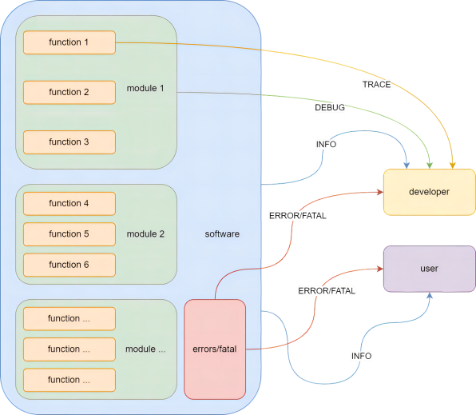

# Logging

The devkits log is implemented based on the `Boost:: log` library and encapsulates some basic log operations.

## log severity

The devkits log supports the following levels:

`FATAL`/`ERROR`/`WARNING`/`INFO`/`DEBUG`/`TRACE`

Header files to include:

```c++
#include "libdevcore/Log.h"
```

For example, use the logs in `libdevccore` directly in the following ways:

```c++
LOG(TRACE) << "This is a trace log";
LOG(DEBUG) << "This is a debug log";
LOG(INFO) << "This is a info log";
LOG(WARNING) << "This is a warning log";
LOG(ERROR) << "This is a error log";
LOG(FATAL) << "This is a fatal log";
```

At different stages of software development, developers pay different attention to code operation:

- In the software development stage, developers are more concerned about whether a function has completed its task. They will add logs to the input/output location of the function to focus on the function's work. At this time, the most detailed level of logs, namely, the `TRACE` level, should be used.

- When completing a module composed of multiple functions, it is often necessary to evaluate the overall health of the module. At this time, a `DEBUG` level log is used to monitor the collaboration between modules.

- When the module is completed, it means that the basic functions of a software have been provided. Next, it is to complete all the functions of a software through combination. At this point, the object of information provided by the software running log is not only the developer, but also the user needs to complete the corresponding action or obtain the relevant information according to the prompts of the software running log. At this time, the applied log level is `INFO`.

- When the software runs abnormally, you need to prompt the developer or user. If an exception does not cause an error in the overall operation of the software, but an error that is expected by the software and can be corrected automatically, use `ERROR` to prompt.
- If the exception of the software has exceeded the scope of the software's ability to accept and handle, you need to use a `FATAL` level log to prompt, indicating that the current software has experienced a serious exception and cannot continue running or ensure the correctness of the running results, which requires human intervention.


