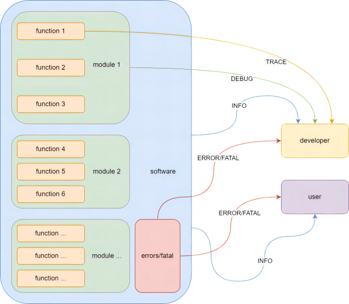

# 使用日志

devkits的日志是基于`Boost::log`库实现的，封装了一些基本的日志操作。

## 日志等级

devkits的日志支持以下几种等级的日志：

`FATAL`/`ERROR`/`WARNING`/`INFO`/`DEBUG`/`TRACE`

使用例如以下方式直接使用`libdevcore`中的日志：

```c++
LOG(TRACE) << "This is a trace log";
LOG(DEBUG) << "This is a debug log";
LOG(INFO) << "This is a info log";
LOG(WARNING) << "This is a warning log";
LOG(ERROR) << "This is a error log";
LOG(FATAL) << "This is a fatal log";
```

在软件开发的不同阶段，开发者们对于代码运行状况的关注度是不一样的。



例如，在软件开发阶段，开发者比较关心某个函数是否完成了它的任务，则会在函数的输入输出位置加上日志以关注函数的工作情况，此时应当使用最详细级别的日志等级也就是`TRACE`级别。

当完成由多个函数组成的模块时，往往需要对该模块的整体运行状况进行评估，此时就要用到`DEBUG`等级的日志，用于开发者监控各模块间的协作。

模块完成之时也就意味着一个软件基本功能已经具备了，接下来就是通过组合来完成一个软件的全部功能。此时，软件运行日志提供信息的对象已经不只是开发者了，用户也需要根据软件运行日志的提示，完成相应的动作或获取相关的信息，此时应用到的日志等级便是`INFO`。

当软件运行出现异常时，需要向开发者或用户进行提示。若出现的异常不会导致软件的整体运行出错，而是在软件预期内且软件能够自动进行矫正的错误，使用`ERROR`来进行提示。若软件出现的异常已经超出软件能够接受处理的能力范畴，就需要使用`FATAL`等级的日志来提示，表明当前软件已经出现了严重异常而无法继续运行或保证运行结果的正确性，急需人为干涉。